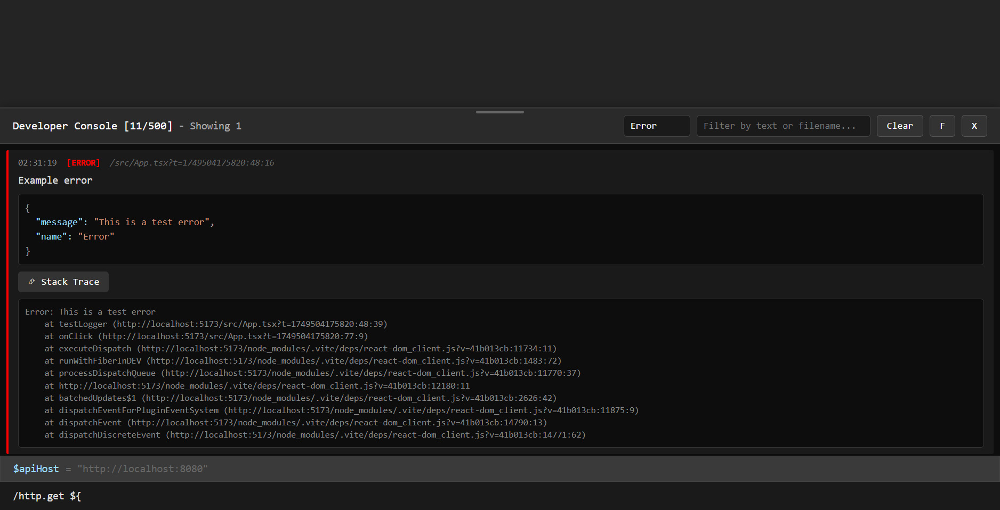
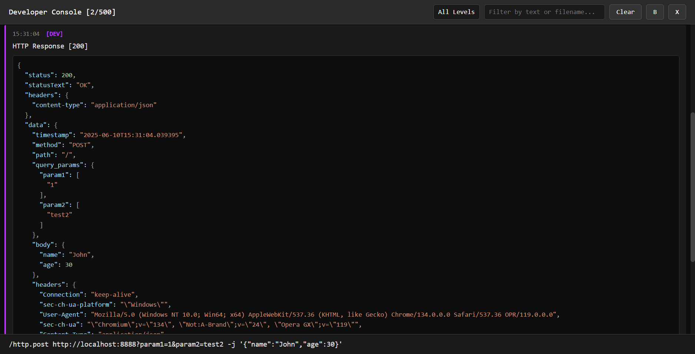

# DevConsole

A drop-in development logger with a built-in console UI for debuging React applications. DevConsole provides powerful logging with export support, real-time variable inspection, command execution, and an extensible plugin system—all while remaining safe for production environments.

## Features

* Drop-in integration with any React project (Only Vite confirmed)
* Multiple log levels: `debug`, `info`, `warn`, `error`, and `dev`
* Visual console UI toggled via `~` key
* REPL-style JavaScript execution with `>` prefix
* Custom and built-in commands using `/` prefix
* Source tracking & export logs to a JSON file
* Pre-included extensions for HTTP & Storage management
* Configurable and production-safe



## Installation

```bash
npm install react-devconsole
# or
yarn add react-devconsole
# or
pnpm add react-devconsole
```

## Quick Start

### Environment Configuration

Control logger behavior with `VITE_DEV_CONSOLE` in `.env` files:

#### Modes

* `disable`: (default) No logging or console code bundled
* `hidden`: Console bundled but not activated by default (can enable via `activateDevConsole`)
* `active`: Fully active with UI and logs enabled

```env
# .env.development
VITE_DEV_CONSOLE=active

# .env.production
VITE_DEV_CONSOLE=disable
```

In `vite.config.ts`:

```ts
define: {
  'import.meta.env.VITE_DEV_CONSOLE': JSON.stringify(process.env.VITE_DEV_CONSOLE || 'disable')
}
```

### Configuration

```tsx
import { DevConsole, DevConsoleUI, configureDevConsole } from 'react-devconsole';

configureDevConsole({
  maxLogs: 1000,
  enableConsoleOutput: true,
  enableSourceTracking: true,
});
```

### Add Console UI

```tsx
function App() {
  return (
    <>
      <DevConsoleUI />
      {/* Your application */}
    </>
  );
}
```

### Example Usage

```tsx
DevConsole.info('App started');
DevConsole.debug('Debugging state', { user: 'Alice' });
DevConsole.error('Unexpected error', new Error('Oops'));
```

## Command System

Prefix commands with `/` in the console:

* `/help` – Show all available commands with descriptions
* `/clear`, `clear`, or `cls` – Clear the console
* `/export` – Export logs to a JSON file
* `/var` – Manage runtime variables
  * `/var` or `/var list` – List all variables
  * `/var set <name> <value>` – Set a variable
  * `/var get <name>` – Get a variable value
  * `/var delete <name>` – Delete a variable

You can also register custom commands:

```ts
DevConsole.registerCommand({
  name: 'echo',
  description: 'Echo input text',
  handler: (args) => DevConsole.dev(args.join(' ')),
});
```

## JavaScript Evaluation

Start any command with `>` to evaluate JavaScript:

```ts
> 2 + 2
> window.location.href
> document.title
```

## Variables and Substitution

Define variables and reuse them:

```ts
DevConsole.setVariable('apiHost', 'https://api.example.com');
DevConsole.setVariable('userId', 42);
```

```shell
# Then use in command:
/http.get ${apiHost}/users/${userId}
```

---

## Extensions

### HTTP Extension

```ts
import { activateHttpExtension, setUserHeaders } from 'react-devconsole';

await activateHttpExtension();

await setUserHeaders({
  Authorization: 'Bearer token',
});
```

Supported commands:

* `/http.headers [show|clear|set <key> <value>]` - Manage user-defined headers
* `/http.request <method> <url> [-u] [-H "Key: Value"] [-j \'{"key":"value"}\'] [key=value...]` - Custom HTTP request
* `/http.get <url>?query [-u] [-H "Header: Value"] [-j '{"key":"value"}'] [key=value...]`
* `/http.post <url>?query [-u] [-H "Header: Value"] [-j '{"key":"value"}'] [key=value...]`
* `/http.put <url>?query [-u] [-H "Header: Value"] [-j '{"key":"value"}'] [key=value...]`
* `/http.delete <url>?query [-u] [-H "Header: Value"] [-j '{"key":"value"}'] [key=value...]`

**Options:**

* `-u` - Include user-defined headers (set with `/http.headers`)
* `-H "Header: Value"` - Add custom headers
* `-j '{"key":"value"}'` - Send JSON body (must be quoted)
* `key=value` - Send form data (when not using `-j`)

**Examples:**

```bash
# POST with JSON body
/http.post https://api.example.com/users -j '{"name":"John","age":30}'

# POST with form data
/http.post https://api.example.com/users name=John age=30

# GET with headers and query parameters
/http.get https://api.example.com/users?status=active -H "Authorization: Bearer token"
```



### Storage Extension

```ts
import { activateStorageExtension } from 'react-devconsole';

await activateStorageExtension();
```

Commands include:

* `/storage.ls` - list local storage keys
* `/storage.ss` - list session storage keys
* `/storage.set <ls|ss> <key> <value>` - set key-value pair in local/session storage
* `/storage.clear <ls|ss|all>` - clear local/session storage or both
* `/storage.export` - export local/session storage to a file
* `/cookies.list` - list cookies
* `/cookies.clear [domain]` - set a cookie

### Logging

```ts
DevConsole.debug(message, data?)
DevConsole.info(message, data?)
DevConsole.warn(message, data?)
DevConsole.error(message, error?)
DevConsole.dev(message, data?)
```

## Keyboard Shortcuts

* `~` – Toggle console
* `↑ / ↓` – Command history
* `Tab` – Autocomplete
* `Escape` – Close UI/autocomplete

## Production Safety

DevConsole is safe for production use. When the `VITE_DEV_CONSOLE` variable is set to `disable`, all logging calls are replaced with no-op implementations, and the bundle does not include the DevConsole UI or logic.

For environments like staging or QA, use `hidden` mode for optional activation via DevTools:

## TODO List

* [ ] Improve command registration and help generation. For now, it's hard to determine which commands are registered by which extensions and which are user custom commands.
